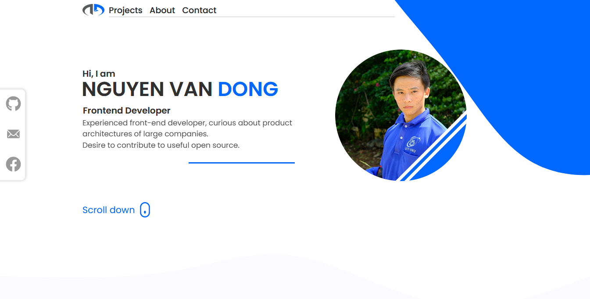

# portfolio-react
## Preview:

## Installation and Setup Instructions:

Clone down this repository. You will need node.js installed globally on your machine..
 
In the project directory, you can run:

#### npm install

#### npm start

Runs the app in the development mode.
Open http://localhost:3000 to view it in the browser.

If you like this and want show your support, just star it.

Designed and coded by: [Neil Nguyen](https://github.com/dongnvsince1999)
